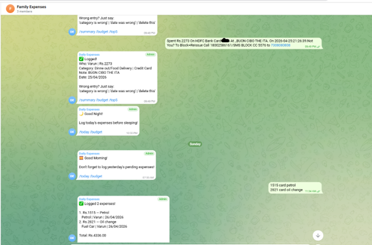
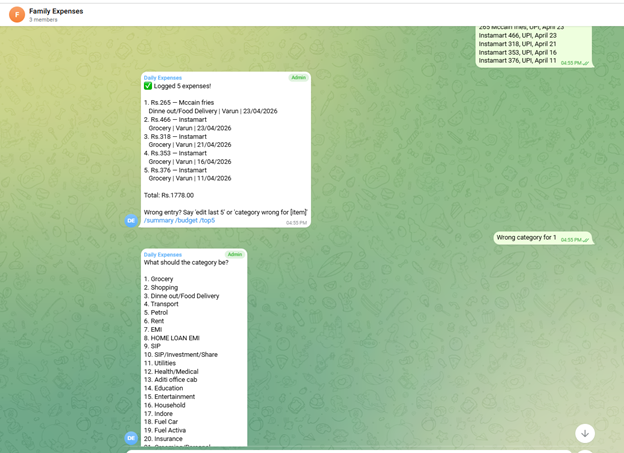
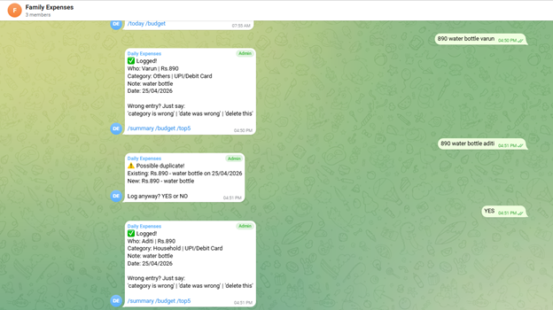
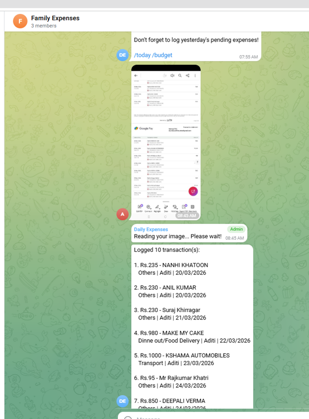
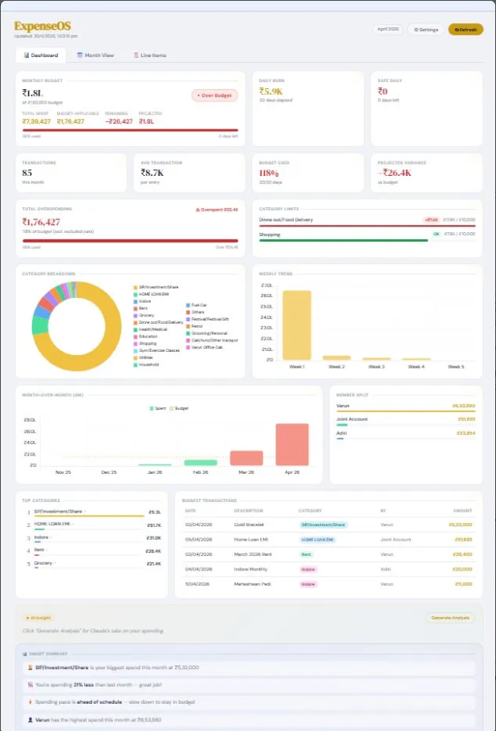

# 🤖 Family Expense Tracker Bot

A Telegram bot for tracking family expenses using natural language (Hindi / Hinglish / English).  
Built on **Google Apps Script** + **Claude Haiku API** + **Google Sheets** — zero server, zero hosting cost.

> **Current version:** v12 | **Status:** Production

---

## Screenshots

### Bank SMS → Auto-logged in seconds


### Multi-item expense + instant category correction


### Smart duplicate detection


### Photo scan → 10 transactions logged at once


### AI-powered web dashboard (ExpenseOS)


---

## What It Does

Send a message like `"500 groceries"` or `"Swiggy 340 aditi ka"` and the bot:
- Parses the expense using Claude AI
- Logs it to Google Sheets instantly
- Confirms with category, member, and payment type
- Alerts you if budget thresholds are crossed

Supports full natural language corrections, queries, and config changes — all from Telegram chat.

---

## Tech Stack

| Layer | Technology |
|---|---|
| Runtime | Google Apps Script (V8) |
| AI | Claude Haiku (`claude-haiku-4-5`) |
| Database | Google Sheets |
| Interface | Telegram Bot API |
| Hosting | GAS Web App (free) |

---

## Features

### Expense Logging
- Natural language input — Hindi, Hinglish, English all work
- Multi-item expenses in one message (up to ~6 items reliably)
- Auto-detects: amount, category, member, payment type, date
- Bank SMS parsing — paste SMS, it extracts the debit
- Receipt/bill photo → AI reads and logs expenses
- Refunds as negative amounts — auto-reduces all totals
- Duplicate detection with YES/NO confirmation
- Category uncertainty flag — logs immediately, notifies if guessed

### Queries
- `/summary` — current month breakdown by category + member
- `/summary feb` — any specific month
- `/budget` — spent vs budget, days left, daily allowance
- `/today`, `/week` — quick filters
- `/top5` — highest expenses this month
- `/trend` — category-wise 3-month trend (AI-generated)
- `/find [keyword]` — search across all expenses
- `/who [member]` — member-wise breakdown

### Corrections (after logging)
- "category is wrong" → instant correction flow
- "delete last" → deletes most recent entry
- `/edit 5` → pick from last 5, edit any field
- `/delete 5` → pick from last 5 to delete
- All corrections use `last_logged` state (10-min window for instant fix)

### Alerts
- Budget alerts at 80% / 90% / 99% — fires once per level per month
- Category-specific alerts (e.g. Shopping > 6% of budget)
- Inactivity reminder if no expense logged in N days
- Morning / night reminders via scheduled triggers

### Config (via chat)
- "add category Vacation" → adds to bot's active list
- "set budget 300000" → updates monthly budget
- "reminder morning 7" → sets daily 7 AM reminder
- "set shopping limit 10%" → updates category alert threshold
- `/addcategory`, `/addmember`, `/addtransaction` slash commands

---

## Slash Commands Reference

| Command | Description |
|---|---|
| `/summary` | Current month summary |
| `/summary [month]` | e.g. `/summary feb` |
| `/budget` | Budget status with daily allowance |
| `/today` | Today's expenses |
| `/week` | This week's expenses |
| `/top5` | Top 5 expenses this month |
| `/trend` | 3-month category trend |
| `/find [keyword]` | Search expenses |
| `/who [member]` | Member-wise breakdown |
| `/edit [n]` | Edit from last n entries |
| `/delete [n]` | Delete from last n entries |
| `/setreminder [args]` | Set a reminder |
| `/showreminders` | List active reminders |
| `/deletereminder [args]` | Remove a reminder |
| `/addcategory [name]` | Add new category |
| `/addmember [name]` | Add family member |
| `/addtransaction [type]` | Add payment type |
| `/listconfig` | Show current config |
| `/members` | List family members |
| `/monthlyreport` | Download PDF report |
| `/help` | Show help |

---

## Setup Instructions

### Prerequisites
- Google account
- Telegram account
- Anthropic API key ([console.anthropic.com](https://console.anthropic.com))
- Telegram Bot Token (from [@BotFather](https://t.me/BotFather))

### Step 1 — Google Sheet Setup
1. Create a new Google Sheet
2. Name the first sheet `Expenses-2026`
3. Note the Sheet ID from the URL: `docs.google.com/spreadsheets/d/YOUR_SHEET_ID/`
4. Set up header rows in rows 1–7 (rows 8+ are data rows)

### Step 2 — Apps Script Setup
1. Go to [script.google.com](https://script.google.com) → New Project
2. Paste the CONFIG block at the top (fill in your real values — see below)
3. Paste the full `expense_bot_v12.js` code below CONFIG
4. Save the project

### Step 3 — CONFIG Block
```javascript
var CONFIG = {
  BOT_TOKEN: "YOUR_TELEGRAM_BOT_TOKEN",
  CHAT_ID: "YOUR_TELEGRAM_GROUP_CHAT_ID",
  SHEET_ID: "YOUR_GOOGLE_SHEET_ID",
  SHEET_NAME: "Expenses-2026",
  DATA_START_ROW: 8,
  MONTHLY_BUDGET: 250000,
  FAMILY_MEMBERS: ["Member1", "Member2", "Joint Account"],
  CATEGORIES: [
    "Grocery", "Shopping", "Dinne out/Food Delivery", "Transport", "Petrol",
    "Rent", "EMI", "HOME LOAN EMI", "SIP", "SIP/Investment/Share",
    "Utilities", "Health/Medical", "Education", "Entertainment",
    "Household", "Fuel Car", "Fuel Activa", "Insurance",
    "Grooming/Personal", "Cab/Auto/Other transport",
    "Festival/Festival Gift", "Electronics", "Others", "Unknown"
  ],
  PAYMENT_TYPES: ["Cash", "Credit Card", "UPI/Debit Card"],
  CLAUDE_API_KEY: "YOUR_CLAUDE_API_KEY",
  CATEGORY_ALERTS: {
    "Shopping": 6,
    "Dinne out/Food Delivery": 3,
    "Entertainment": 1
  }
};
```
> ⚠️ Never commit this block with real values. Keep secrets only in the GAS editor.

### Step 4 — Deploy
1. Click **Deploy → New deployment**
2. Type: **Web App**
3. Execute as: **Me**
4. Who has access: **Anyone**
5. Deploy → Copy the `/exec` URL (NOT `/dev`)

### Step 5 — Connect Telegram
1. In GAS editor, hardcode your `/exec` URL in `setWebhook()` function
2. Run `setWebhook()` once
3. Run `setupTriggersV2()` once (sets up scheduled reminders)
4. Run `authorizeDrive()` once (enables PDF report generation)

### Step 6 — Test
Send `"100 coffee"` to your Telegram bot. You should get a confirmation message back.

---

## Redeployment (After Code Changes)

```
Deploy → Manage deployments → Edit → Version: New version → Deploy
```
Then run `setWebhook()` again with the **same `/exec` URL**.

> ⚠️ Do NOT use `ScriptApp.getService().getUrl()` — it returns the `/dev` URL which breaks the webhook.

---

## Architecture

```
Telegram Message
      ↓
  doPost()
      ↓
  LockService (race condition prevention)
      ↓
  loadPersistedConfig() (Script Properties → CONFIG)
      ↓
  Media? → handleMedia()
  Slash command? → handleCommand()
  Delete/Edit state? → processDeleteEditReply()
  YES/NO? → confirm pending / cancel state
  Category correction? → processCategoryConfirmReply()
      ↓
  detectMasterIntent()
    ├─ quickIntentCheck() — regex, ~60% resolved here
    └─ Claude Haiku — fallback for ambiguous messages
      ↓
  expense → parse → duplicate check → logToSheet()
  query   → handleQuery() → Claude Haiku answer
  correction → handleInteractiveCorrection()
  config  → handleInteractiveConfig()
```

### Key Design Decisions

**Data direction:** `logToSheet()` inserts at `DATA_START_ROW` (row 8) pushing everything down. Newest entries are always at the top. `getRecentExpenses()` reads top-down from row 8.

**State management:** All state stored in Script Properties with `chatId` suffix. Cleared on NO/cancel. State expires where needed (e.g. `last_logged` expires after 10 minutes).

**Intent routing:** Rule-based regex runs first (`quickIntentCheck`). Only truly ambiguous messages hit the Claude API — reduces latency and API cost by ~60%.

**Category uncertainty:** If Claude isn't confident about a category, the expense is logged immediately (not blocked) and the user is notified. Say "category is wrong" to correct it.

---

## State Keys Reference

| Key | Purpose |
|---|---|
| `edit_mode_<chatId>` | Active edit flow: `pick / field / direct_value` |
| `edit_selected_<chatId>` | Selected entry for editing |
| `edit_list_<chatId>` | List shown during edit selection |
| `delete_mode_<chatId>` | Active delete flow |
| `delete_list_<chatId>` | List shown during delete selection |
| `cat_correct_<chatId>` | Category correction pending |
| `last_logged_<chatId>` | Last logged entry (for instant correction) |
| `last_logged_ts_<chatId>` | Timestamp of last logged (10 min expiry) |
| `pending_<chatId>` | Duplicate confirmation pending |
| `last_inactivity_run` | Date of last inactivity reminder (ddMMyyyy) |
| `config_categorys` | Persisted custom categories |
| `config_members` | Persisted custom members |
| `config_payments` | Persisted custom payment types |
| `override_budget` | Budget override set via chat |

---

## Known Limitations

- **Max ~6 items per message** reliably. More hits Claude's `max_tokens` limit and falls back to regex parsing.
- **Categories added via chat** are saved to Script Properties only. To survive a redeployment, also add them to `CONFIG.CATEGORIES` in the code.
- **No persistent logs sheet** — GAS `Logger` entries are ephemeral. Observability is a P3 todo.

---

## Pending Work (P3)

- [ ] Single state object refactor — replace all fragmented `state_<chatId>` keys with one JSON object
- [ ] Bounds check before delete/edit — protect against stale `rowIndex` after sheet edits
- [ ] Logs sheet for observability — persist GAS logs to a separate sheet

---

## 🚀 Want This for Your Family?

This bot is available for setup assistance.  
Reach out via:
- 📧 Email: varunmaheshwari307@gmail.com
- 💬 Telegram: [@varunmaheshwari30](https://t.me/varunmaheshwari30)

---

## Security Notes

- `BOT_TOKEN`, `CLAUDE_API_KEY`, `SHEET_ID`, `CHAT_ID` — **never commit to Git**
- CONFIG block in this repo uses placeholder values only
- Real values live exclusively in the GAS editor
- Bot only responds to the configured `CHAT_ID` (family group)

---

## License

Private project. Not intended for public distribution.
